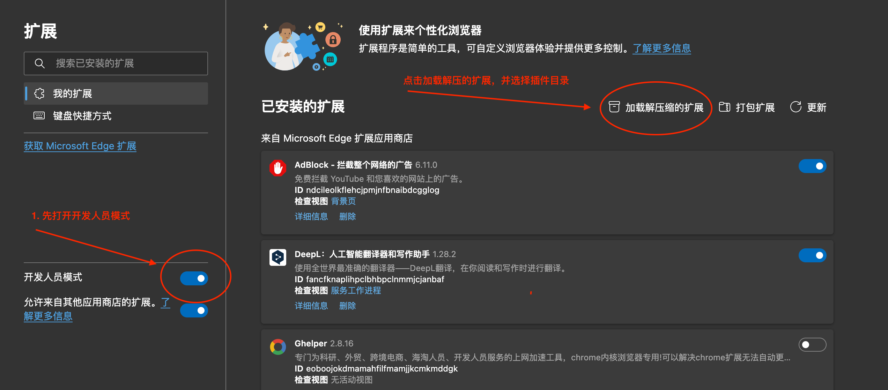

## 背景

解决 Axures 需求多语言映射 Key问题。

## 使用说明

使用 Edge 或者 Chrome 添加已解压的插件(dist目录)， 需要浏览器的插件开发者模式打开。

准备需要匹配的多语言 Excel,(**首行包含Key|En**)。打开对应的 Axure 需求页面，选择插件，选择文件后自动匹配。

> 注意事项：
>
> 1. 先打开网页，后安装插件，会无法执行（无法通信），刷新一下页面即可。
> 2. 如果需求比较多，可能需要加载一会儿

## 已知问题

（缺陷）换行文本可能无法匹配，多行文本是多个标签，故无法匹配。

目前存在少量不配不上。